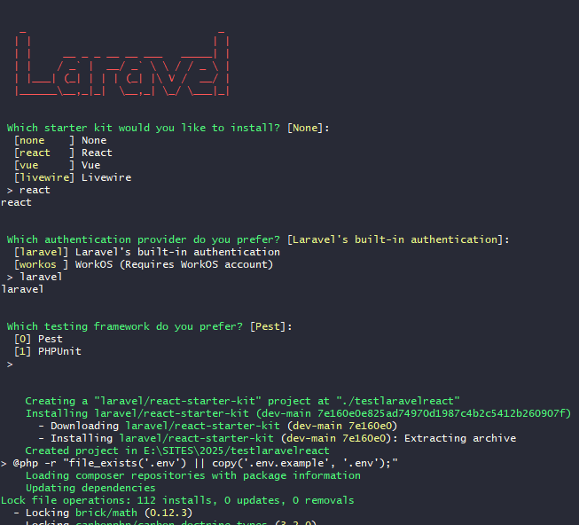

# laravel12react
## Laravel 12 with React
## Description

Documentation pour l'installation de Laravel 12 avec React.

https://laravel.com/docs/12.x/installation

https://endoflife.date/laravel

### Installateur

```bash
composer global require laravel/installer
```
### Créer un projet

```bash
laravel new testlaravelreact
```

### choix de react



### Installer les dépendances

```bash
cd testlaravelreact
npm install && npm run build
composer run dev
```
